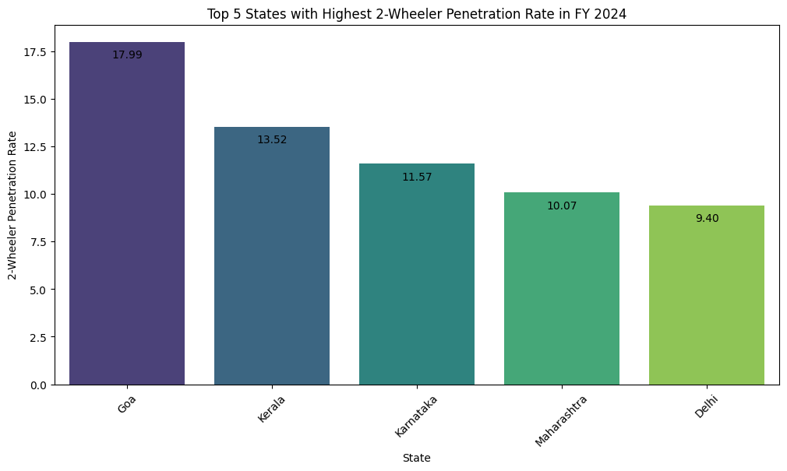
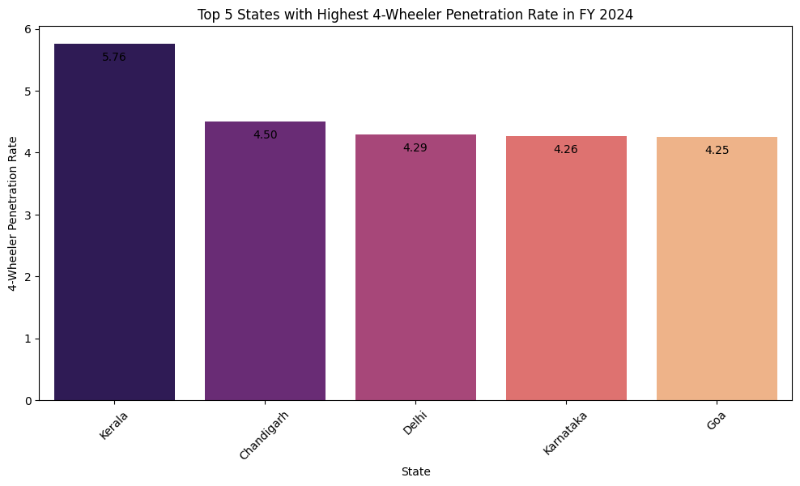
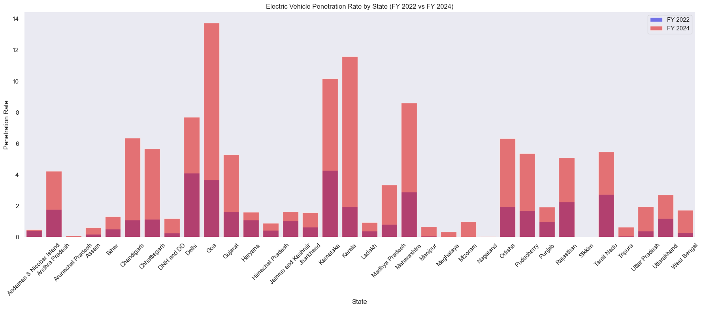
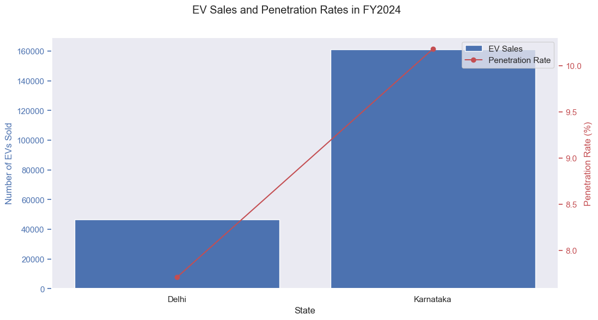
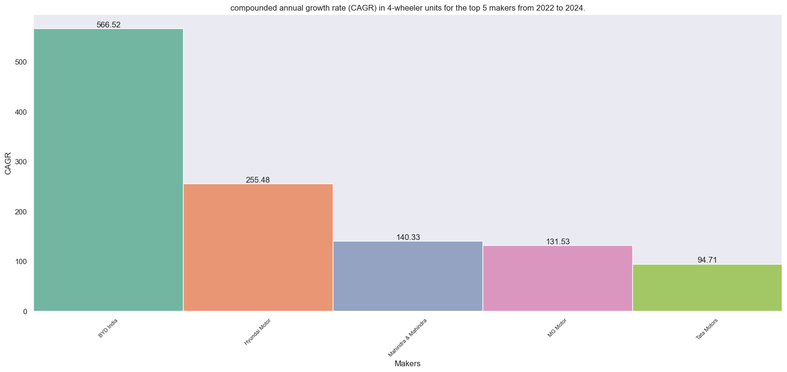
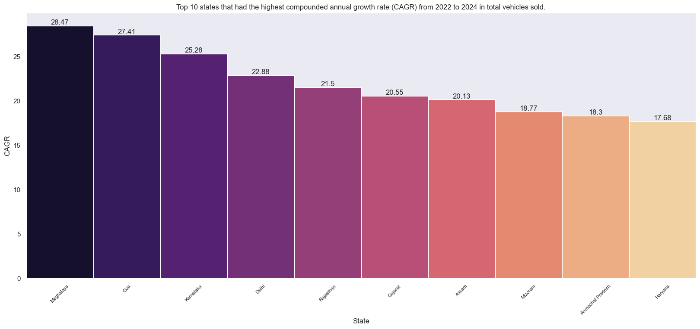
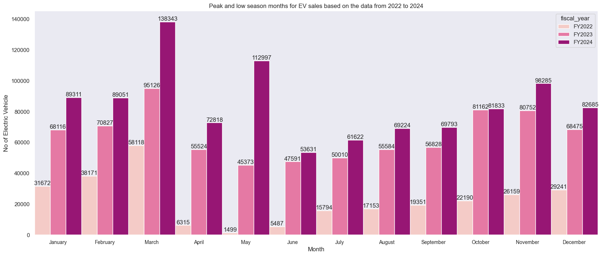
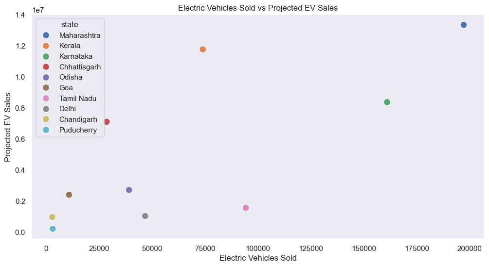
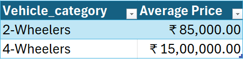
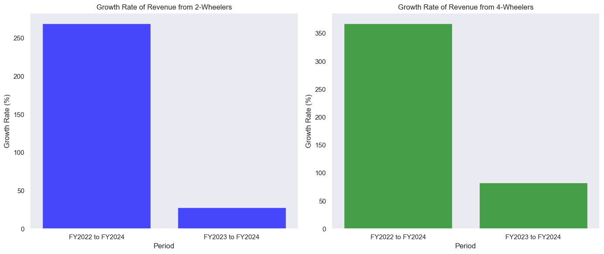

# Overview

Welcome to my analysis of the EV Market for year 2022 to 2024. This project was created in order to understand the EV Market as part of the expansion plans of Atliq Motors. 

# Problem Statement 

AtliQ Motors is an automotive giant from the USA specializing in electric vehicles (EV). In the last 5 years, their market share rose to 25% in electric and hybrid vehicles segment in North America. As a part of their expansion plans, they wanted to launch their bestselling models in India where their market share is less than 2%. Bruce Haryali, the chief of AtliQ Motors India wanted to do a detailed market study of existing EV/Hybrid market in India before proceeding further. Bruce gave this task to the data analytics team of AtliQ motors and as a Data Analyst we need to analyze the EV Market. 

# The Questions

Below are the questions I want to answer in my project:

1.	List the top 3 and bottom 3 makers for the fiscal years 2023 and 2024 in terms of the number of 2-wheelers sold.
2.	Identify the top 5 states with the highest penetration rate in 2-wheeler and 4-wheeler EV sales in FY 2024.
3.	List the states with negative penetration (decline) in EV sales from 2022 to 2024? 
4.	What are the quarterly trends based on sales volume for the top 5 EV makers (4-wheelers) from 2022 to 2024?
5.	How do the EV sales and penetration rates in Delhi compare to Karnataka for 2024?
6.	List down the compounded annual growth rate (CAGR) in 4-wheeler units for the top 5 makers from 2022 to 2024.
7.	List down the top 10 states that had the highest compounded annual growth rate (CAGR) from 2022 to 2024 in total vehicles sold.
8.	What are the peak and low season months for EV sales based on the data from 2022 to 2024? 
9.	What is the projected number of EV sales (including 2-wheelers and 4-wheelers) for the top 10 states by penetration rate in 2030, based on the compounded annual growth rate (CAGR) from previous years? 
10.	Estimate the revenue growth rate of 4-wheeler and 2-wheelers EVs in India for 2022 vs 2024 and 2023 vs 2024, assuming an average unit price.


# Tools I Used

For my deep dive into the EV market, I harnessed the power of several key tools:

- **Python:** The backbone of my analysis, allowing me to analyze the data and find critical insights.I also used the following Python libraries:
    - **Pandas Library:** This was used to analyze the data. 
    - **Matplotlib Library:** I visualized the data.
    - **Seaborn Library:** Helped me create more advanced visuals. 
- **Jupyter Notebooks:** The tool I used to run my Python scripts which let me easily include my notes and analysis.
- **Visual Studio Code:** My go-to for executing my Python scripts.
- **Git & GitHub:** Essential for version control and sharing my Python code and analysis, ensuring collaboration and project tracking.

# Data Preparation and Cleanup

This section outlines the steps taken to prepare the data for analysis, ensuring accuracy and usability.

## Import & Clean Up Data

I start by importing necessary libraries and loading the dataset, followed by initial data cleaning tasks to ensure data quality.

```python
# Importing Libraries
import pandas as pd
import os 
import matplotlib.pyplot as plt
import seaborn as sns
import calendar


# Loading Data
df = pd.read_csv(r'E:\RPC12_Input_For_Participants\Electric Vehicle Analysis Python\datasets\electric_vehicle_sales_by_makers.csv')
df2 = pd.read_csv(r'E:\RPC12_Input_For_Participants\Electric Vehicle Analysis Python\datasets\electric_vehicle_sales_by_state.csv')

# Data Cleanup
df['date'] = pd.to_datetime(df['date'], format='mixed')
df2['date'] = pd.to_datetime(df2['date'], format='mixed')
```


# The Analysis

Here’s how I approached each question:

## 1.	List the top 3 and bottom 3 makers for the fiscal years 2023 and 2024 in terms of the number of 2-wheelers sold.

To find the most the top 3 and bottom 3 makers for the fiscal years 2023 and 2024 in terms of the number of 2-wheelers sold i created a function to find the Fiscal Year and then filtered the date for 2 wheelers and then created teh function to find top 3  and bottom 3. Then again filtered the date for year 2023 and 2024 in order to get the results. 

### View the code with detailed steps here:.

```python
def get_fiscal_year(date):
    fiscal_year_start_month = 4  
    fiscal_year_start_day = 1
    year = date.year
    month = date.month
    day = date.day
    
    if month < fiscal_year_start_month or (month == fiscal_year_start_month and day < fiscal_year_start_day):
        fiscal_year = year - 1
    else:
        fiscal_year = year

    return f"FY{fiscal_year+1}"


df['fiscal_year'] = df['date'].apply(get_fiscal_year)

df_2_wheelers = df[df['vehicle_category'] == '2-Wheelers']
df_filtered = df_2_wheelers[df_2_wheelers['fiscal_year'].isin(['FY2023', 'FY2024'])]
df_4_wheelers = df[df['vehicle_category'] == '4-Wheelers']

final_results = df_filtered.groupby(['fiscal_year', 'maker'])[['electric_vehicles_sold']].sum().reset_index()

def get_top_bottom(df, fiscal_year):
    df_year = df[df['fiscal_year'] == fiscal_year]
    df_sorted = df_year.sort_values(by='electric_vehicles_sold', ascending=False)
    top_3 = df_sorted.head(3)
    bottom_3 = df_sorted.tail(3)
    return top_3, bottom_3

top_3_FY2023, bottom_3_FY2023 = get_top_bottom(final_results, 'FY2023')
top_3_FY2024, bottom_3_FY2024 = get_top_bottom(final_results, 'FY2024')

```


### Visualize Data

```python
plt.figure(figsize=(20, 8))
ax = sns.barplot(data = final_results, x = 'maker', y ='electric_vehicles_sold',hue='fiscal_year',palette='Blues',width=1)
for bars in ax.containers:
    ax.bar_label(bars)
plt.title('2-Wheelers Sales by Fiscal Year')
plt.xticks(rotation= 45,size=8)
plt.ylabel('Number of Vehicles')
plt.xlabel('Makers')
plt.show()
```

### Results


*Bar graph visualizing the sales for 2 wheelers for 2023 and 2024 *

### Insights:

- OLA Electric is clearly the winner for FY 2023 and 2024. 
- Even thought OLA Electric leads the way. The competition is there with the others since the positions in each year has been changed  

## 2.	Identify the top 5 states with the highest penetration rate in 2-wheeler and 4-wheeler EV sales in FY 2024.


To find top 5 states with the highest penetration rate in 2-wheeler and 4-wheeler EV sales in FY 2024. Using the previous function i created the Fiscal year column and then filtered the data based on Fiscal year and created a function to find the penetration rate for both 2 wheelers and 4 wheelers and then again filtered to top 5 to get the desired result. 

### View the code with detailed steps here:.


```python
df2['fiscal_year'] = df2['date'].apply(get_fiscal_year)
df2_FY2024 = df2[df2['fiscal_year']== 'FY2024']
df2_FY2023 = df2[df2['fiscal_year']== 'FY2023']
df2_FY2022 = df2[df2['fiscal_year']== 'FY2022']

df2_2wheelers_FY2024 = df2_FY2024[df2_FY2024['vehicle_category']== '2-Wheelers']
df2_4wheelers_FY2024 = df2_FY2024[df2_FY2024['vehicle_category']== '4-Wheelers']

def calculate_penetration_rate (df2, category): 
    total_vehicle_sold = df2.groupby('state')['total_vehicles_sold'].sum()
    electric_vehicle_sold = df2.groupby('state')['electric_vehicles_sold'].sum()
    penetration_rate = ((electric_vehicle_sold/total_vehicle_sold)*100).reset_index()
    penetration_rate.columns = ['state', f'{category}_penetration_rate_%']   
    return penetration_rate

penetration_rate_2wheelers = calculate_penetration_rate(df2_2wheelers_FY2024,'2-Wheelers' )
penetration_rate_4wheelers = calculate_penetration_rate(df2_4wheelers_FY2024,'4-Wheelers' )

top5_States_Penetration_Rate_2wheelers = penetration_rate_2wheelers.sort_values(by='2-Wheelers_penetration_rate_%',ascending=False).head(5)
top5_States_Penetration_Rate_4wheelers = penetration_rate_4wheelers.sort_values(by='4-Wheelers_penetration_rate_%',ascending=False).head(5)

```


### Visualize Data

```python
plt.figure(figsize=(12, 6))
ax = sns.barplot(data = top5_States_Penetration_Rate_2wheelers, x = 'state', y ='2-Wheelers_penetration_rate_%', hue= 'state', palette='viridis')
for p in ax.patches:
    ax.annotate(format(p.get_height(), '.2f'), 
                (p.get_x() + p.get_width() / 2., p.get_height()), 
                ha = 'center', va = 'center', 
                xytext = (0, -12), 
                textcoords = 'offset points')
plt.title('Top 5 States with Highest 2-Wheeler Penetration Rate in FY 2024')
plt.ylabel('2-Wheeler Penetration Rate')
plt.xlabel('State')
plt.xticks(rotation=45)
plt.show()

```

### Results






*Bar graph visualizing the top 5 states with Penetration Rate for 2023 and 2024 *


### Insights:

- Kerala is top 2 and top 1 for 2- wheeler and 4 - wheeler respectively. 
- It seems the tourism is having impact on the penetration rate as the state is a tourism hub. Even GOA is known for tourism is listed in the top 5 for both category. 


## 3.	List the states with negative penetration (decline) in EV sales from 2022 to 2024? 


To find List the states with negative penetration (decline) in EV sales from 2022 to 2024. Created the function to find the penetration rate and then filtered and sorted the data to find the penetration rate for 2022  and 2024 separately to find any decline in sales. 


### View the code with detailed steps here:.


```python


def calculate_penetration_rate_all(df2):
    total_vehicle_sold = df2.groupby(['state','fiscal_year'])['total_vehicles_sold'].sum()
    electric_vehicle_sold = df2.groupby(['state','fiscal_year'])['electric_vehicles_sold'].sum()
    penetration_rate = ((electric_vehicle_sold/total_vehicle_sold)*100).reset_index()
    penetration_rate.columns = ['state','fiscal_year','%_penetration_rate']
    return penetration_rate

penetration_rate_FY2022 = calculate_penetration_rate_all(df2_FY2022)
penetration_rate_FY2022['%_penetration_rate'] = penetration_rate_FY2022['%_penetration_rate'].round(2)
penetration_rate_FY2024 = calculate_penetration_rate_all(df2_FY2024)
penetration_rate_FY2024['%_penetration_rate'] = penetration_rate_FY2024['%_penetration_rate'].round(2)
merged_penetration_rate =pd.merge(penetration_rate_FY2022, penetration_rate_FY2024,on='state', suffixes=['FY2022','FY2024'])

penetration_rate_FY2022.sort_values('%_penetration_rate').head(5)

penetration_rate_FY2024.sort_values('%_penetration_rate').head(5)

declining_states = merged_penetration_rate[merged_penetration_rate['%_penetration_rateFY2024'] < merged_penetration_rate['%_penetration_rateFY2022']]

if declining_states.empty:
    print("No states experienced a decline in EV penetration rate from FY 2022 to FY 2024.")
else:
    print("States with a decline in EV penetration rate from FY 2022 to FY 2024:")
    print(declining_states[['state', 'penetration_rate_FY2022', 'penetration_rate_FY2024']])


```

### Visualize Data

```python

sns.set_theme(style="dark")


plt.figure(figsize=(18, 8))


sns.barplot(x='state', y='%_penetration_rateFY2022', data=merged_penetration_rate, color='blue', alpha=0.6, label='FY 2022')


sns.barplot(x='state', y='%_penetration_rateFY2024', data=merged_penetration_rate, color='red', alpha=0.6, label='FY 2024')


plt.xlabel('State')
plt.ylabel('Penetration Rate')
plt.title('Electric Vehicle Penetration Rate by State (FY 2022 vs FY 2024)')
plt.xticks(rotation=45)
plt.legend()


plt.tight_layout()
plt.show()

```

### Results




*Bar graph visualizing the Penetration Rate for 2022 and 2024 *


### Insights:

- As expected there is no decline in penetration rate. Penetration rate is increasing on yearly basis. 

## 4.	What are the quarterly trends based on sales volume for the top 5 EV makers (4-wheelers) from 2022 to 2024?


To find the quarterly trends based on sales volume for the top 5 EV makers (4-wheelers) from 2022 to 2024. Function was created to find the quarter and then withe already filtered Data Frame for 4 wheelers sorted and filters the Data to find the quarterly trend. 


### View the code with detailed steps here:.

```python

def get_custom_quarter(date):
    month = date.month
    if month in [1, 2, 3]:
        return 'Q4'  # Q4
    elif month in [4, 5, 6]:
        return 'Q1'  # Q1
    elif month in [7, 8, 9]:
        return 'Q2'  # Q2
    elif month in [10, 11, 12]:
        return 'Q3'  # Q3


df_4_wheelers.loc[:, 'quarter'] = df_4_wheelers['date'].apply(get_custom_quarter)

df_trends = df_4_wheelers.sort_values(['quarter','fiscal_year'])

df_trends_sales_quarterly = df_trends.groupby(['maker','fiscal_year','quarter'])['electric_vehicles_sold'].sum().reset_index()

total_sales = df_trends_sales_quarterly.groupby('maker')['electric_vehicles_sold'].sum().reset_index()
top_5_makers = total_sales.sort_values(by='electric_vehicles_sold',ascending=False).head(5)['maker']

top_5_sales = df_trends_sales_quarterly[df_trends_sales_quarterly['maker'].isin(top_5_makers)]

```

### Visualize Data

```python


plt.figure(figsize=(18, 8))
sns.lineplot(data=top_5_sales, x='quarter', y='electric_vehicles_sold', hue='maker', style='fiscal_year', markers=True, dashes=False)
plt.title('Quarterly Sales Trends for Top 5 EV Makers (4-Wheelers) from 2022 to 2024')
plt.xlabel('Quarter')
plt.ylabel('Electric Vehicles Sold')
plt.legend(title='Maker and Fiscal Year')
plt.tight_layout()
plt.show()

```

### Results


*Line graph visualizing the Quarterly Sales Trends for top 5 - 4 Wheeler EV makers from 2022 to 2024 *


### Insights:

-  Quarterly Sales Trends is clearly indicating TATA Motors as the leader in the sales.
- All others except Mahindra & Mahindra is not showing any trend. 
-Mahindra & Mahindra is declining in each quarter for 2024 which is not a good trend for the company.  


## 5.	How do the EV sales and penetration rates in Delhi compare to Karnataka for 2024?

To compare EV sales and penetration rates. Filtered and sorted the Data in order to find the EV Sales and Penetration Rate and converting and combining the Data Frame.  


### View the code with detailed steps here:.

```python

penetration_rate_FY2024_Delhi= penetration_rate_FY2024[penetration_rate_FY2024['state']== 'Delhi'] 
penetration_rate_FY2024_Karnataka= penetration_rate_FY2024[penetration_rate_FY2024['state']== 'Karnataka']

df2_FY2024 = df2[df2['fiscal_year']=='FY2024']

EV_Sales = df2_FY2024.groupby('state')['electric_vehicles_sold'].sum().reset_index()

EV_Sales_Delhi = EV_Sales[EV_Sales['state']=='Delhi'] 
EV_Sales_Karnataka = EV_Sales[EV_Sales['state']=='Karnataka'] 

penetration_data = pd.DataFrame({
    'state': ['Delhi', 'Karnataka'],
    'penetration_rate': [penetration_rate_FY2024_Delhi['%_penetration_rate'].values[0], penetration_rate_FY2024_Karnataka['%_penetration_rate'].values[0]]
})


combined_data = EV_Sales.merge(penetration_data, on='state')


```


### Visualize Data

```python

fig, ax1 = plt.subplots(figsize=(12, 6))

# Bar chart for EV sales
ax1.bar(combined_data['state'], combined_data['electric_vehicles_sold'], color='b', label='EV Sales')
ax1.set_xlabel('State')
ax1.set_ylabel('Number of EVs Sold', color='b')
ax1.tick_params('y', colors='b')

# Line chart for penetration rates
ax2 = ax1.twinx()
ax2.plot(combined_data['state'], combined_data['penetration_rate'], color='r', label='Penetration Rate', marker='o')
ax2.set_ylabel('Penetration Rate (%)', color='r')
ax2.tick_params('y', colors='r')

fig.suptitle('EV Sales and Penetration Rates in FY2024')
fig.legend(loc='upper right', bbox_to_anchor=(1,1), bbox_transform=ax1.transAxes)
plt.show()


```

### Results



* Bar and Line graph visualizing the EV Sales and Penetration Rates in FY2024 - Delhi vs Kanataka*


### Insights:

- Chart indicating that Penetration rate is having direct impact on the EV Sales. 
- Difference in Penetration Rate is around 3-4 % between Karnataka and Delhi but the Karnataka has 4 times sales than Delhi. 


## 6.	List down the compounded annual growth rate (CAGR) in 4-wheeler units for the top 5 makers from 2022 to 2024.

To find the CAGR for 4-wheeler units for the top 5 makers from 2022 to 2024. Defined the function for finding the CAGR and then Filtered and sort to get the results. 


### View the code with detailed steps here:.

```python

top_5_sales.loc[:,'year']= top_5_sales['fiscal_year'].str.extract(r'FY(\d{4})', expand=False).astype(int)
top_5_sales_maker = top_5_sales.groupby(['year','maker'])['electric_vehicles_sold'].sum().reset_index()

def calculate_cagr(df, value_column, year_column):
    beginning_value = df[value_column].iloc[0]
    ending_value = df[value_column].iloc[-1]
    years = df[year_column].iloc[-1]-df[year_column].iloc[0]   
    if beginning_value == 0:
        cagr= (ending_value)** (1/years)-1
    else:            
        cagr = (ending_value/beginning_value)** (1/years)-1
    return cagr


def calculate_cagr_group(group, value_column):
cagr = calculate_cagr(group, value_column, 'year')
return pd.DataFrame({
    'CAGR': [cagr],
    'electric_vehicles_sold': [group[value_column].iloc[-1]]
})

cagr_results = top_5_sales_maker .groupby('maker').apply(lambda x: calculate_cagr_group(x, 'electric_vehicles_sold')).sort_values(by='CAGR', ascending=False).reset_index()
cagr_results = cagr_results.drop(columns=['level_1'])

cagr_results['CAGR'] = (cagr_results['CAGR']*100).round(2)

top_5_makers = top_5_sales_maker.groupby('maker')['electric_vehicles_sold'].sum().sort_values(ascending=False).reset_index()

cagr_final = pd.merge(cagr_results,top_5_makers, on='maker' )

cagr_final = cagr_final.drop(columns=['electric_vehicles_sold_x', 'electric_vehicles_sold_y'])

```

### Visualize Data

```python

plt.figure(figsize=(20, 8))
ax = sns.barplot(data = cagr_final, x = 'maker', y ='CAGR',hue='maker',palette='Set2',width=1)
for bars in ax.containers:
    ax.bar_label(bars)
plt.title('compounded annual growth rate (CAGR) in 4-wheeler units for the top 5 makers from 2022 to 2024.')
plt.xticks(rotation= 45,size=8)
plt.ylabel('CAGR')
plt.xlabel('Makers')
plt.show()


```

### Results



* Bar graph visualizing the CAGR for 4-wheeler units for the top 5 makers from 2022 to 2024*


### Insights:


- BYD India having a significant difference with others. 
- All the other fours also having a CAGR more than 100 % indicating that sales have increased considerably during the period. 
- CAGR indicating the 4 Wheel industry is growing rapidly. 


## 7.	List down the top 10 states that had the highest compounded annual growth rate (CAGR) from 2022 to 2024 in total vehicles sold.

To find top 10 states that had the highest compounded annual growth rate (CAGR) from 2022 to 2024 in total vehicles sold. Extracted the year column from Fiscal Year and then calculated the CAGR using the Previous function and sorted and filtered to get the result. 


### View the code with detailed steps here:.

```python

df2.loc[:,'year'] = df2['fiscal_year'].str.extract(r'FY(\d{4})', expand=False).astype(int)
df2_states = df2.groupby(['state', 'year'])['total_vehicles_sold'].sum().reset_index()

df2_states_cagr_results = df2_states.groupby(['state']).apply(lambda x: calculate_cagr_group(x,'total_vehicles_sold')).sort_values(by='CAGR', ascending=False).reset_index()
df2_states_cagr_results = df2_states_cagr_results.drop(columns=['level_1'])

df2_states_cagr_results['CAGR'] = (df2_states_cagr_results['CAGR']*100).round(2)

df2_states_cagr_final= df2_states_cagr_results.head(10)

```


### Visualize Data

```python

plt.figure(figsize=(20, 8))
ax = sns.barplot(data = df2_states_cagr_final, x = 'state', y ='CAGR',hue='state',palette='magma',width=1)
for bars in ax.containers:
    ax.bar_label(bars)
plt.title('Top 10 states that had the highest compounded annual growth rate (CAGR) from 2022 to 2024 in total vehicles sold.')
plt.xticks(rotation= 45,size=8)
plt.ylabel('CAGR')
plt.xlabel('State')
plt.show()


```

### Results



* Bar graph visualizing the CAGR for the top 10 states from 2022 to 2024*


### Insights:
 - The top most CAGR is for Meghalaya which was not listed in Top 5 states for sales indicating that some of the states with low sales has increased their sales. 
 - States like GOA, Karnataka and Delhi is having good CAGR and Sales over the years indicating that the growth and sales are increasing and it will continue to grow. 
 - Remaining states also having CAGR more than 17% is a good indication of growth in the industry. 


## 8.	What are the peak and low season months for EV sales based on the data from 2022 to 2024? 

To find the peak and low season months for EV sales based on the data from 2022 to 2024. Created new column month and then converted month to month name using calender library. Then sorted the Data Frame based on sales and then got the result as top and bottom rows. 


### View the code with detailed steps here:.

```python

df['month'] = df['date'].dt.month
df_monthly_sales = df.groupby(['month','fiscal_year'])['electric_vehicles_sold'].sum().reset_index()

df_monthly_sales['month']  = df_monthly_sales['month'].apply(lambda x: calendar.month_name[x])

df_monthly_sales_sorted = df_monthly_sales.sort_values(by='electric_vehicles_sold', ascending=False).reset_index()

peak_month = df_monthly_sales_sorted.head(1)

low_month = df_monthly_sales_sorted.tail(1)

```


### Visualize Data

```python


plt.figure(figsize=(20, 8))
ax = sns.barplot(data = df_monthly_sales, x = 'month', y ='electric_vehicles_sold',hue='fiscal_year',palette='RdPu',width=1)
for bars in ax.containers:
    ax.bar_label(bars)
plt.title('Peak and low season months for EV sales based on the data from 2022 to 2024')
plt.xticks(size=10)
plt.ylabel('No of Electric Vehicle')
plt.xlabel('Month')
plt.show()


```

### Results



* Bar graph visualizing the EV sales Monthly Basis *

### Insights:

- Peak month is March FY 2024 and Low Month is May FY 2022
- Sales has been increased over the time. 
- Comparing the month on respective fiscal year always seen an increase. 
- March month is best performing month for all the Fiscal years. 


## 9.	What is the projected number of EV sales (including 2-wheelers and 4-wheelers) for the top 10 states by penetration rate in 2030, based on the compounded annual growth rate (CAGR) from previous years? 

To find projected number of EV sales (including 2-wheelers and 4-wheelers) for the top 10 states by penetration rate in 2030. Have removed the Fiscal Year column and then sorted and Filtered the Data Frame. Other Data Frame was used to find the CAGR and then merged the Data Frame. Using the new Data Frame calculated the Projected Sales for 2030. 

### View the code with detailed steps here:.

```python
penetration_rate_FY2024 =penetration_rate_FY2024.drop(columns=['fiscal_year'])

state_penetration_rate = penetration_rate_FY2024.sort_values(by='%_penetration_rate', ascending=False)

df2_filtered_state = df2.groupby(['state','year'])['electric_vehicles_sold'].sum().reset_index()

cagr_state = df2_filtered_state.groupby(['state']).apply(lambda x: calculate_cagr_group(x, 'electric_vehicles_sold')).sort_values(by='CAGR', ascending=False).reset_index()
cagr_state['CAGR'] = (cagr_state['CAGR']*100).round(2)
cagr_state = cagr_state.drop(columns=['level_1'])

merged_cagr_state = pd.merge(state_penetration_rate,cagr_state, on='state')

merged_cagr_state_finals= merged_cagr_state.sort_values('%_penetration_rate',ascending=False)

cagr_state_finals = merged_cagr_state_finals.head(10)

def project_ev_sales(current_ev_sales, cagr, n):
    future_ev_sales = current_ev_sales * (1 + cagr / 100) ** n
    return future_ev_sales


n_years = 6
cagr_state_finals['projected_ev_sales'] = cagr_state_finals.apply(lambda row: project_ev_sales(row['electric_vehicles_sold'], row['CAGR'], n_years), axis=1)
cagr_state_finals['projected_ev_sales'] = cagr_state_finals['projected_ev_sales'].apply(lambda x: f"{x:.2f}")
cagr_state_finals['projected_ev_sales'] = cagr_state_finals['projected_ev_sales'].astype(float)
cagr_state_finals = cagr_state_finals.sort_values(by='projected_ev_sales', ascending=False).reset_index(drop=True)

```

### Visualize Data

```python

plt.figure(figsize=(12, 6))
sns.scatterplot(x='electric_vehicles_sold', y='projected_ev_sales', data=cagr_state_finals, hue='state', s=100)
plt.title('Electric Vehicles Sold vs Projected EV Sales')
plt.xlabel('Electric Vehicles Sold')
plt.ylabel('Projected EV Sales')
plt.show()

```

### Results




* Scatter Plot graph visualizing the Projected EV sales vs Current Sales *


### Insights:

- As expected Maharashtra, Kerala and  Karnataka is having high projected sales. 
- Overall there is huge increase in sales indicating the growth of EV industry in India. 


## 10.	Estimate the revenue growth rate of 4-wheeler and 2-wheelers EVs in India for 2022 vs 2024 and 2023 vs 2024, assuming an average unit price.




To find he revenue growth rate of 4-wheeler and 2-wheelers EVs in India for 2022 vs 2024 and 2023 vs 2024. Filtered and sorted the Data Frame to find the sales for 2022

### View the code with detailed steps here:.
```python
df_2_wheelers_FY = df_2_wheelers.groupby(['vehicle_category','fiscal_year'])['electric_vehicles_sold'].sum(). reset_index()

_4_wheelers_FY = df_4_wheelers.groupby(['vehicle_category','fiscal_year'])['electric_vehicles_sold'].sum(). reset_index()

def calculate_specific_growth_rates(df_2_wheelers_FY, df_4_wheelers_FY, price_2w, price_4w):
    
    
    
    
    growth_rates = {}
    
    for start_year, end_year in periods:
        
       
        sales_2w_start = df_2_wheelers_FY[df_2_wheelers_FY['fiscal_year'] == start_year]
        sales_2w_end = df_2_wheelers_FY[df_2_wheelers_FY['fiscal_year'] == end_year]
        
        sales_4w_start = df_4_wheelers_FY[df_4_wheelers_FY['fiscal_year'] == start_year]
        sales_4w_end = df_4_wheelers_FY[df_4_wheelers_FY['fiscal_year'] == end_year]
        
        
        revenue_2w_start = sales_2w_start['electric_vehicles_sold'] * price_2w
        revenue_2w_end = sales_2w_end['electric_vehicles_sold'] * price_2w
        
        revenue_4w_start = sales_4w_start['electric_vehicles_sold'] * price_4w
        revenue_4w_end = sales_4w_end['electric_vehicles_sold'] * price_4w
        
    
        growth_rate_2w = round(((revenue_2w_end.sum() - revenue_2w_start.sum()) / revenue_2w_start.sum()) * 100, 2)
        growth_rate_4w = round(((revenue_4w_end.sum() - revenue_4w_start.sum()) / revenue_4w_start.sum()) * 100, 2)
        
        # Store growth rates
        growth_rates[(start_year, end_year)] = {
            'Growth rate 2-wheelers': growth_rate_2w,
            'Growth rate 4-wheelers': growth_rate_4w
        }
    

    
    return growth_rates
    

periods = [
        ('FY2022', 'FY2023'),
        ('FY2023', 'FY2024')
    ]
growth_rates = calculate_specific_growth_rates(df_2_wheelers_FY, df_4_wheelers_FY, 85000, 1500000)
periods_str = [f'{start_year} to {end_year}' for start_year, end_year in periods]
growth_rate_2w = [growth_rates[('FY2022', 'FY2024')]['Growth rate 2-wheelers'], 
                  growth_rates[('FY2023', 'FY2024')]['Growth rate 2-wheelers']]
growth_rate_4w = [growth_rates[('FY2022', 'FY2024')]['Growth rate 4-wheelers'], 
                  growth_rates[('FY2023', 'FY2024')]['Growth rate 4-wheelers']]

```


### Visualize Data

```python

fig, ax = plt.subplots(1, 2, figsize=(14, 6))


ax1= ax[0].bar(periods_str, growth_rate_2w, color='blue', alpha=0.7)
ax[0].set_title('Growth Rate of Revenue from 2-Wheelers')
ax[0].set_ylabel('Growth Rate (%)')
ax[0].set_xlabel('Period')


ax2 = ax[1].bar(periods_str, growth_rate_4w, color='green', alpha=0.7)
ax[1].set_title('Growth Rate of Revenue from 4-Wheelers')
ax[1].set_ylabel('Growth Rate (%)')
ax[1].set_xlabel('Period')

plt.tight_layout()
plt.show()

```

### Results



* Bar graph visualizing the Growth Rate 2022-2023 vs 2023 -2024 *


### Insights:

- Initial year the growth rate was high.
- The growth rate of revenue from 2-wheelers is higher than that of 4-wheelers. 


# What I Learned

Throughout this project, I deepened my understanding of the EV Market and How EV market is growing in India. 

- **Advanced Python Usage**: Utilizing libraries such as Pandas for data manipulation, Seaborn and Matplotlib for data visualization, and other libraries helped me perform complex data analysis tasks more efficiently.


# Insights

This project provided several general insights into the EV Market for analysts:

- **Market Trends**: There are changing trends in EV Markets over the years. 

- **Market Growth**: The growth rate of revenue from 2-wheelers is higher than that of 4-wheelers

- **Market Analysis**: The EV market is growing rapidly in India and there is a huge scope for a new player to establish their business. 

# Conclusion

This project provided a comprehensive understanding of the EV market in India, allowing AtliQ Motors to make informed decisions regarding their expansion plans. The detailed analysis helped in identifying key trends, top-performing states, and makers, along with future projections. This will be instrumental in driving the strategic goals of AtliQ Motors as they venture into the Indian market.


