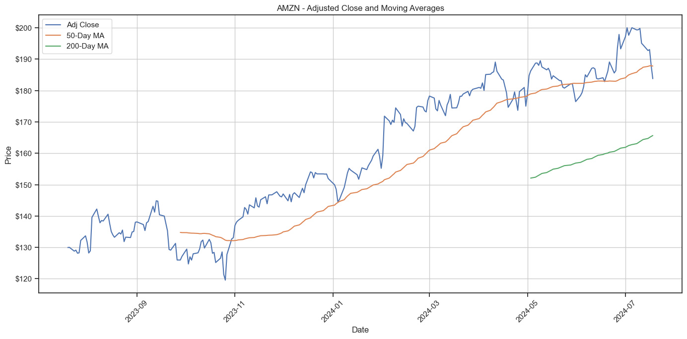
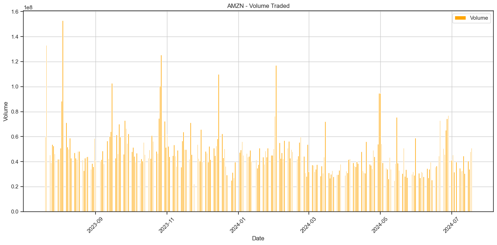
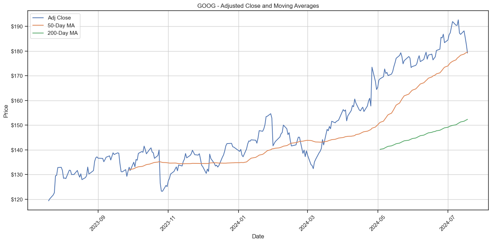
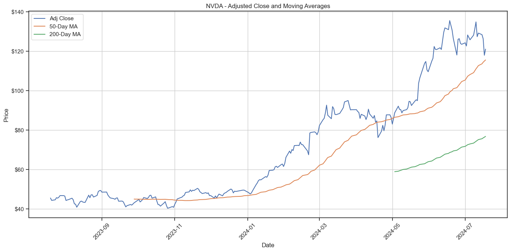
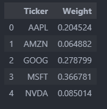

# The Analysis 
Welcome to the analysis of Top 5 Companies in Nasdaq. In order to achieve good returns from the Stock Market the Stocks need to be analyzed based on the historical performances. So here is a small attempt to analyze the stocks and using the insights how decision can be made to optimize the portfolio. 


# The Questions

Below are the questions I want to answer in my project:
 1. How have the stock prices fluctuated over time? Are there any noticeable trends or patterns?
 2. How do the short-term and long-term trends compare? Are there any crossover points indicating potential buy/sell signals?
 3. When were the periods of high trading activity? Do volume spikes correlate with price changes?
 4. What are the average returns and risks associated with each stock? How volatile are these stocks?
 5. What is the ideal mix of these stocks to achieve the best risk-adjusted returns?
 6. What are the expected returns and associated risks for different portfolio combinations? Which portfolios lie on the efficient frontier?


# Tools I Used

For my deep dive into the data analyst job market, I harnessed the power of several key tools:

- **Python:** The backbone of my analysis, allowing me to analyze the data and find critical insights.I also used the following Python libraries:
    - **Pandas Library:** This was used to analyze the data. 
    - **Matplotlib Library:** I visualized the data.
    - **Seaborn Library:** Helped me create more advanced visuals. 
    - **CSV Library:** Got data from CSV. 
    - **Numpy Library** For Mathematical function. 
- **Jupyter Notebooks:** The tool I used to run my Python scripts which let me easily include my notes and analysis.
- **Visual Studio Code:** My go-to for executing my Python scripts.
- **Git & GitHub:** Essential for version control and sharing my Python code and analysis, ensuring collaboration and project tracking.


# Data Preparation and Cleanup

This section describes how the data is prepared and make the necessary clean up and was saved to CSV for further analysis. 

## Import & Clean Up Data

I start by importing necessary libraries and loading the dataset, followed by initial data cleaning tasks to ensure data quality.

```python
# Importing Libraries
import pandas as pd
import yfinance as yf
from datetime import date, timedelta

# Time period for the Data for set 
end_date = date.today().strftime("%Y-%m-%d")
start_date = (date.today() - timedelta(days=365)).strftime("%Y-%m-%d")


tickers = ['MSFT', 'AAPL', 'NVDA', 'GOOG','AMZN'] # Have used the top 5 stocks in Nasdaq

# Data Cleanup
import warnings
warnings.filterwarnings("ignore", category=FutureWarning)
data = yf.download(tickers, start=start_date, end=end_date, progress=False)
data.columns = ['_'.join(col).strip() for col in data.columns.values]
data = data.reset_index()
data_melted = data.melt(id_vars=['Date'], var_name='Attribute_Ticker', value_name='Value')
data_melted[['Attribute', 'Ticker']] = data_melted['Attribute_Ticker'].str.rsplit('_', n=1, expand=True)
data_pivoted = data_melted.pivot_table(index=['Date', 'Ticker'], columns='Attribute', values='Value', aggfunc='first')
stock_data = data_pivoted.reset_index()

# Save the resulting DataFrame to a CSV file
stock_data.to_csv('stock_data.csv', index=False)
```


# The Analysis

 ## 1. How have the stock prices fluctuated over time? Are there any noticeable trends or patterns?

 To find the stock fluctuated over the time. I have imported the CSV file and plotted the chart average closing period over the time period. So that we can visualize the price movement of each stocks. 


### Visualize Data

```python

# Reading the data from csv
stock_data = pd.read_csv('stock_data.csv')


stock_data['Date'] = pd.to_datetime(stock_data['Date'])
stock_data.set_index('Date', inplace=True)
stock_data.reset_index(inplace=True)

# Plotting
plt.figure(figsize=(14, 7))
sns.set_theme(style='ticks')
sns.lineplot(data=stock_data, x='Date', y='Adj Close', hue='Ticker', marker='o')
plt.gca().yaxis.set_major_formatter(plt.FuncFormatter(lambda y, pos: f'${int(y)}'))
plt.title('Adjusted Closing Price Over Time', fontsize=16)
plt.xlabel('Date', fontsize=14)
plt.ylabel('Adjusted Closing Price', fontsize=14)
plt.legend(title='Ticker', title_fontsize='13', fontsize='11')
plt.grid(True)
plt.xticks(rotation=25)
plt.show()

```

### Results


### Insights:


- MSFT (Microsoft) consistently had the highest adjusted closing price, staying above $300 throughout the time period.
- AAPL (Apple) and AMZN (Amazon) had similar trends, with their adjusted closing prices mostly stable and closely clustered around the $100 to $200 range.
- GOOG (Google) showed a similar trend to AAPL and AMZN but slightly higher, generally between $100 and $150.
- NVDA (NVIDIA) had a notable increase in its adjusted closing price starting around March 2024, showing a strong upward trend compared to the other stocks.
- Overall, MSFT showed a significant increase over the time period, while NVDA experienced the most substantial growth among the stocks listed.


## 2. How do the short-term and long-term trends compare? Are there any crossover points indicating potential buy/sell signals? &  3. When were the periods of high trading activity? Do volume spikes correlate with price changes?
 


### Visualize Data

```python
short_window = 50
long_window = 200

stock_data.set_index('Date', inplace=True)
unique_tickers = stock_data['Ticker'].unique()

for ticker in unique_tickers:
    ticker_data = stock_data[stock_data['Ticker'] == ticker].copy()
    ticker_data['50_MA'] = ticker_data['Adj Close'].rolling(window=short_window).mean()
    ticker_data['200_MA'] = ticker_data['Adj Close'].rolling(window=long_window).mean()

    # Plotting the 
    plt.figure(figsize=(14, 7))
    plt.plot(ticker_data.index, ticker_data['Adj Close'], label='Adj Close')
    plt.plot(ticker_data.index, ticker_data['50_MA'], label='50-Day MA')
    plt.plot(ticker_data.index, ticker_data['200_MA'], label='200-Day MA')
    plt.gca().yaxis.set_major_formatter(plt.FuncFormatter(lambda y, pos: f'${int(y)}'))
    plt.title(f'{ticker} - Adjusted Close and Moving Averages')
    plt.xlabel('Date')
    plt.ylabel('Price')
    plt.legend()
    plt.grid(True)
    plt.xticks(rotation=45)
    plt.tight_layout()
    plt.show()

    plt.figure(figsize=(14, 7))
    plt.bar(ticker_data.index, ticker_data['Volume'], label='Volume', color='orange')
    plt.title(f'{ticker} - Volume Traded')
    plt.xlabel('Date')
    plt.ylabel('Volume')
    plt.legend()
    plt.grid(True)
    plt.xticks(rotation=45)
    plt.tight_layout()
    plt.show()

```

### Results




### Insights:


Moving Averages (50-day and 200-day)

- AAPL (Apple) : Golden cross over happened in June 2024 and this a bullish sign that the trend might be changing from bearish to bullish. We can see a significant increase in stock price.  
- MSFT (Microsoft), AMZN (Amazon), GOOG (Google), NVDA (NVIDIA) : Similar trend was shown by all these stocks. Stock price was inline with 50-day Moving average and few times they have crossed 50 Day Moving average and then reversal happened and continuing the Bullish trend. 

Trading Volume
- MSFT (Microsoft): Consistent trading volume throughout the period with occasional spikes during major price movements.
- AAPL (Apple) and AMZN (Amazon): Similar trading volume patterns with noticeable increases during earnings announcements and product releases.
- GOOG (Google): Moderate trading volume with occasional peaks corresponding to market events and announcements.
- NVDA (NVIDIA): Significant increase in trading volume around March 2024, aligning with its upward price trend.

Except AAPL (Apple) all stocks was in bullish territory and with Golden Crossover AAPL (Apple) also became bullish and volume was also indicating the same. 


## 4. What are the average returns and risks associated with each stock? How volatile are these stocks?
 


### Visualize Data

```python

stock_data['Daily Return'] = stock_data.groupby('Ticker')['Adj Close'].pct_change()

plt.figure(figsize=(14, 7))
sns.set_style(style='whitegrid')

for ticker in unique_tickers:
    ticker_data = stock_data[stock_data['Ticker'] == ticker]
    sns.histplot(ticker_data['Daily Return'].dropna(), bins=50, kde=True, label=ticker, alpha=0.5)

plt.title('Distribution of Daily Returns', fontsize=16)
plt.xlabel('Daily Return', fontsize=14)
plt.ylabel('Frequency', fontsize=14)
plt.legend(title='Ticker', title_fontsize='13', fontsize='11')
plt.grid(True)
plt.tight_layout()
plt.show()

```

### Results


### Insights:

Distribution are normal and centered around zero which shows that the daily return and average return are almost same. Apple and Google are having wider distribution suggesting the volatility compared to over the stocks. 


## 5. What is the ideal mix of these stocks to achieve the best risk-adjusted returns?


### Visualize Data

```python
daily_returns = stock_data.pivot_table(index='Date', columns='Ticker', values='Daily Return')
correlation_matrix = daily_returns.corr()

plt.figure(figsize=(12, 10))
sns.set_style(style='whitegrid')

sns.heatmap(correlation_matrix, annot=True, cmap='coolwarm', linewidths=.5, fmt='.2f', annot_kws={"size": 10})
plt.title('Correlation Matrix of Daily Returns', fontsize=16)
plt.xticks(rotation=90)
plt.yticks(rotation=0)
plt.tight_layout()
plt.show()

```


### Results


### Insights:

The highest correlation was shown by Amazon and Microsoft (0.58) amd almost similar was Google and Amazon. These stocks correlation ranges from (0.27) to (0.58). These combinations are very effective in diversified portfolio and combination of low correlation will reduce the potential risk. 


##  6. What are the expected returns and associated risks for different portfolio combinations? Which portfolios lie on the efficient frontier?


### Visualize Data


```python

import numpy as np
expected_returns = daily_returns.mean() * 252  # annualize the returns
volatility = daily_returns.std() * np.sqrt(252)  # annualize the volatility

stock_stats = pd.DataFrame({
    'Expected Return': expected_returns,
    'Volatility': volatility
})

stock_stats


```


### Results


### Insights:

Google and Amazon is a potential good investment considering the expected returns and volatility. Apple and Microsoft being the low risk safe investment with low volatility 22% and 19% respectively. Nvidia is high risk high return stock with Expected Return 109% and 46% volatility. 


#### Results

```python

# function to calculate portfolio performance
def portfolio_performance(weights, returns, cov_matrix):
    portfolio_return = np.dot(weights, returns)
    portfolio_volatility = np.sqrt(np.dot(weights.T, np.dot(cov_matrix, weights)))
    return portfolio_return, portfolio_volatility

# number of portfolios to simulate
num_portfolios = 10000

# arrays to store the results
results = np.zeros((3, num_portfolios))

# annualized covariance matrix
cov_matrix = daily_returns.cov() * 252

np.random.seed(42)

for i in range(num_portfolios):
    weights = np.random.random(len(unique_tickers))
    weights /= np.sum(weights)

    portfolio_return, portfolio_volatility = portfolio_performance(weights, expected_returns, cov_matrix)

    results[0,i] = portfolio_return
    results[1,i] = portfolio_volatility
    results[2,i] = portfolio_return / portfolio_volatility  # Sharpe Ratio

plt.figure(figsize=(10, 7))
plt.scatter(results[1,:], results[0,:], c=results[2,:], cmap='inferno', marker='o')
plt.title('Efficient Frontier')
plt.xlabel('Volatility (Standard Deviation)')
plt.ylabel('Expected Return')
plt.colorbar(label='Sharpe Ratio')
plt.grid(True)
plt.show()


max_sharpe_idx = np.argmax(results[2])
max_sharpe_return = results[0, max_sharpe_idx]
max_sharpe_volatility = results[1, max_sharpe_idx]
max_sharpe_ratio = results[2, max_sharpe_idx]

max_sharpe_return, max_sharpe_volatility, max_sharpe_ratio


```


Generating a random portfolio and plotting the efficient frontier shows that the stocks with high risk is giving high returns. Expected return and volatility are for good sharp ratio. The gradient shows that portfolios with higher Sharpe ratios  provide better risk-adjusted returns.

The portfolio with the maximum Sharpe ratio has the following characteristics:

- Expected Return: ~75.39%
- Volatility: ~29.86%
- Sharpe Ratio: ~2.52

```python


max_sharpe_weights = np.zeros(len(unique_tickers))

for i in range(num_portfolios):
    weights = np.random.random(len(unique_tickers))
    weights /= np.sum(weights)

    portfolio_return, portfolio_volatility = portfolio_performance(weights, expected_returns, cov_matrix)

    if results[2, i] == max_sharpe_ratio:
        max_sharpe_weights = weights
        break

portfolio_weights_df = pd.DataFrame({
    'Ticker': unique_tickers,
    'Weight': max_sharpe_weights
})

portfolio_weights_df


```

Weights of the stocks in the portfolio that yield the maximum Sharpe ratio:



So this shows that a diversified portfolio with have the following allocations. 

1. Apple - 20.45 % 
2. Amazon - 6.48 % 
3. Google - 27.87 % 
4. Microsoft - 36.67 % 
5. Nvidia - 8.50 % 


# Conclusion

A balanced portfolio is a mixture of diversified stock with high and low risk stocks which will give consistent returns over the period of time. So in order to optimize the portfolio we need to analyze the price trends, calculating expected returns and volatilizes, and determining the correlations between different stocks to achieve diversification.

